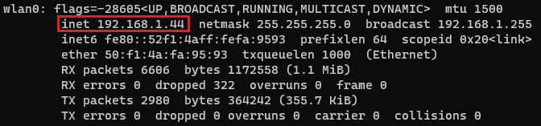

# BeagleBone Setup
A BeagleBone serves as the heart of this project. In this section I'll go through the steps I took to get a BeagleBone up and running and ready to program. I'm going to assume that the board being used is a BeagleBone Blue.

## First Steps
These first steps are primarily taken from the beagleboard [getting started guide](https://beagleboard.org/getting-started).
### Flashing the Firmware
The first step is simply to flash the latest firmware image available for the BeagleBone. Balena Etcher is the program for SD card programming I've seen recommended most often (and the one I've used). 

The firmware images can be found here: [Latest Images](https://beagleboard.org/latest-images)  
Balena Etcher can be downloaded here: [Balena Etcher](https://www.balena.io/etcher/)
### First Boot
The next step is to insert the SD card into the BeaglBone Blue and connect it to a PC using a Micro-USB to USB cable (with the normal USB end in the PC). When the BeagleBone is powered up, it should be possible to ssh into it from the host PC. I'm using a PC running Windows 10 with Ubuntu 20.04 on WSL2 (**W**indows **S**ubsystem for **L**inux), so the IP address I'll be using is `192.168.7.2`. If you are using Mac OSX or Linux the IP address is `192.168.6.2`.
```
ssh debian@192.168.7.2
```
The default password is **temppwd**.

We want to enable WiFi so that we can update and download software on our BeagleBone. To do this, we use a utility called `connmanctl`.

```
connmanctl
enable wifi
scan wifi
services
```
At this point you should see a list of WiFi networks, with the format:
```
    network1    wifi_50f14afa9593_...
    network2    wifi_...
``` 
Identify your network and note the WiFi ID on the right. To connect to the network, the commands are
```
agent on
connect wifi_...
```
Enter the WiFi password as directed and then use `quit` to exit the utility.

To find the IP address of the BeagleBone, we use `ifconfig`. The output is shown below.

In my case the IP address is `192.168.1.44`. I can now ssh into the BeagleBone over the WiFi network, which saves me a precious USB port on my PC. To do this I type the following command into my terminal:
```
ssh debian@192.168.1.44
```
The password is once again **temppwd**

## Updating the Software
To update the software on the BeagleBone, we use the following commands:
```
cd /opt/scripts
git pull
sudo tools/update_kernel.sh
sudo shutdown -r now
```
Once the BeagleBone has rebooted, ssh back in and run 
```
sudo apt update
sudo apt upgrade
sudo /opt/scripts/version.sh
```

## Final Tests
Finally we want to check that we have access to the PRUs, which was something that gave me some trouble. To test if everything is working run
```
rc_test_drivers
```
If everything goes smoothly then you are good to go. I experienced at various points during my attempts at setting up the BeagleBone Blue, that the pru-rproc and/or the ADC iio tests failed. I found to remedies, both of which seemed to work. At the moment I'm not certain what either of these do, but my recommendation would be to start with the first one and then reboot. If `rc_test_drivers` still fails some tests, try the second option and reboot.
```
sudo /opt/scripts/tools/update_kernel.sh --ti-rt-channel --lts-4_19
```
```
sudo dd if=/dev/zero of=/dev/mmcblk1 bs=1M count=10
```
## Conclusion
Hopefully at this point you have a BeagleBone with access to WiFi and access to the PRUs.
